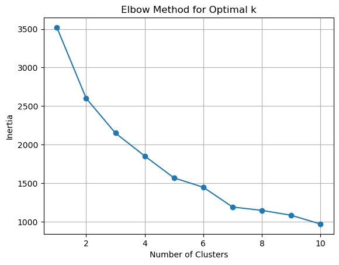
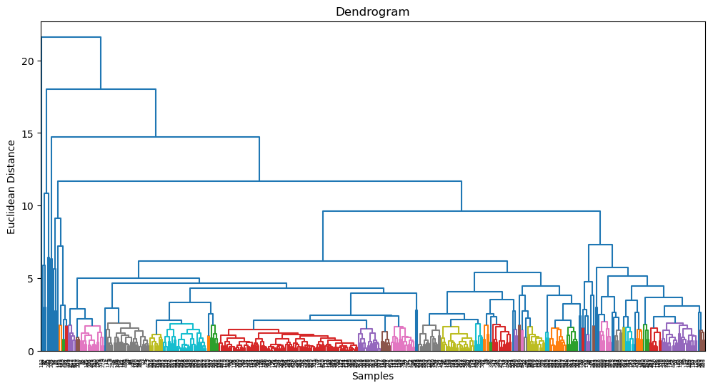
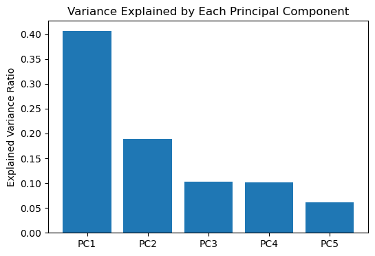

# machine_learning_project-unsupervised-learning

## Unsupervised Learning: Wholesale Customers Analysis

This project applies unsupervised learning techniques to a real-world dataset from a wholesale distributor. The goal is to uncover natural groupings in customer purchasing behavior to inform better marketing, inventory, or customer segmentation strategies. The key objectives were to:

- Perform exploratory data analysis (EDA)
- Apply KMeans and Hierarchical Clustering
- Conduct Principal Component Analysis (PCA)
- Derive meaningful business insights


## 📊 Dataset Overview

The dataset includes annual spending on six product categories by clients:

- Fresh
- Milk
- Grocery
- Frozen
- Detergents_Paper
- Delicatessen

Each row represents a customer, and columns contain product expenditures.

## Project Objectives

### 1. Exploratory Data Analysis
- Analyzed distribution of features using histograms and boxplots
- Identified skewed distributions and outliers
- Scaled the data using `MinMaxScaler` to normalize features

### 2. KMeans Clustering
- Used the elbow method and silhouette scores to determine the optimal number of clusters
- Chose **5 clusters**
- Profiled each cluster to understand customer groups



### 3. Hierarchical Clustering
- Generated a dendrogram to visualize the merging process
- Chose **5 clusters** based on dendrogram cut
- Cluster assignments revealed meaningful hierarchical groupings



### 4. Principal Component Analysis (PCA)
- Reduced the data to 2 dimensions for visualization
- The first two principal components explain **58%** of the total variance


## Key Techniques Used

- **Exploratory Data Analysis (EDA)** using pandas, seaborn, and matplotlib
- **KMeans Clustering** with elbow method and silhouette score for choosing optimal `k`
- **Hierarchical Clustering** with dendrograms and Agglomerative Clustering
- **PCA** to reduce dimensionality while preserving variance
- **Cluster profiling** to interpret each segment

## 📌 Key Findings

- PCA revealed that the first two principal components explained over **58% of the variance** in the data.
- **KMeans Clustering** identified **five meaningful customer segments** based on purchasing patterns.
- Cluster profiles highlighted clear differences in customer preferences, such as bulk buyers of fresh items vs those with high detergent and grocery purchases.
- These insights can be used to **target marketing efforts** or customize product bundles.
- PCA helped to simplify and visualize the dataset while retaining most of the variance.
- KMeans and Hierarchical Clustering produced **consistent groupings**, adding confidence to the cluster profiles.

---

## 📁 Project Structure

```bash
.
├── Wholesale_Data.csv
├── Unsupervised Learning - Project.ipynb
├── images/
│   ├── kmeans_pca.png
│   ├── dendrogram.png
│   └── pca_variance.png
└── README.md

## ✅ How to Run

1. Clone the repository:
   ```bash
   git clone https://github.com/Ikenna1414/ml-project-unsupervised-learning.git


